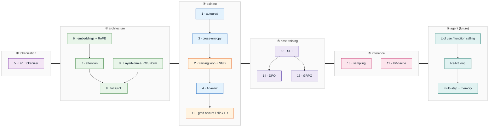

# learning-llm-from-scratch

## Loop

Per mechanism — read first, then learn by repetition:

1. Read — study the mechanism and its math from the reference. Skim if familiar, dig in if new.
2. Repeat until fluent — rebuild from memory in blind0.ipynb, then blind1, blind2, … Each pass is a fresh drill, checked against production and fixed. Repetition is where it sticks.
3. Promote & verify — the clean version becomes main.py; allclose @ rtol=1e-4 confirms it.
4. Keep — write the README summary; revisit questions.md later to confirm it stuck.

## Dependency graph

Build order, left to right: tokenization → architecture → training → post-training → inference → agent. Numbers match the [index](#index). Node color = category; the training block folds in the foundations primitives (blue). Agent is future work.



## Index

15 core mechanisms in build order; the [graph](#dependency-graph) above regroups them by category.

| # | Mechanism | Category | Status | Verified against | One-line takeaway |
|---|-----------|----------|--------|------------------|-------------------|
| 1 | [autograd](foundations/autograd/) | foundations | 🔲 | `torch.autograd` | — |
| 2 | [training loop + SGD](training/training-loop/) | training | 🔲 | `torch.optim.SGD` | — |
| 3 | [cross-entropy](foundations/cross-entropy/) | foundations | 🔲 | `F.cross_entropy` | — |
| 4 | [AdamW](foundations/adamw/) | foundations | 🔲 | `torch.optim.AdamW` | — |
| 5 | [BPE tokenizer](tokenization/bpe/) | tokenization | 🔲 | HF `tokenizers` | — |
| 6 | [embeddings + RoPE](architecture/rope/) | architecture | 🔲 | Llama reference impl | — |
| 7 | [attention (single → multi-head)](architecture/attention/) | architecture | 🔲 | `F.scaled_dot_product_attention` | — |
| 8 | [LayerNorm & RMSNorm](architecture/layernorm-rmsnorm/) | architecture | 🔲 | `nn.LayerNorm` / Llama RMSNorm | — |
| 9 | [full GPT](architecture/gpt/) | architecture | 🔲 | nanoGPT | — |
| 10 | [sampling (greedy/temp/top-k/top-p)](inference/sampling/) | inference | 🔲 | HF `generate` | — |
| 11 | [KV-cache](inference/kv-cache/) | inference | 🔲 | no-cache generation (identical outputs) | — |
| 12 | [grad accumulation + clipping + LR schedules](training/grad-accumulation/) | training | 🔲 | math identity: N steps ≡ batch×N | — |
| 13 | [SFT with prompt masking](post-training/sft/) | post-training | 🔲 | `trl.SFTTrainer` | — |
| 14 | [DPO](post-training/dpo/) | post-training | 🔲 | `trl.DPOTrainer` | — |
| 15 | [GRPO](post-training/grpo/) | post-training | 🔲 | `trl` / `verl` | — |

Status legend: 🔲 planned · 🟡 in progress · ✅ done (allclose passed) · 🎓 graduated (blind < target time, 3 clean drill passes)

## Setup

```bash
uv sync            # create .venv/ from pyproject.toml
uv run python ...  # run inside .venv
```

Data, checkpoints, and logs live on `/workspace` (uncommitted).
