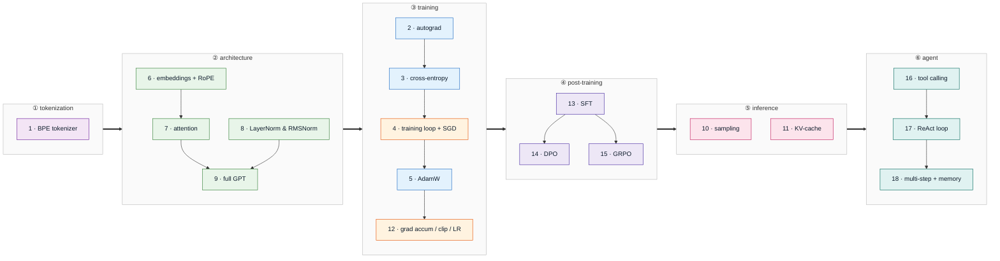

# learning-llm-components

Method — read first, then learn by repetition: [docs/method.md](docs/method.md).

## Dependency graph

Category flow, left to right: tokenization → architecture → training → post-training → inference → agent. Numbers match the [index](#index) learning order. Node color = category; the training block folds in the foundations primitives (blue).



## Index

19 core mechanisms in learning order; the [graph](#dependency-graph) above regroups them by category.

Dirs are `<cat>_<mechanism>` — `tok` · `fnd` · `trn` · `arc` · `inf` · `pst` · `agt`. Both
halves are stable, so **this table owns the order**: adding or dropping a mechanism is a
one-row edit and never renames a directory.

| # | Mechanism | Category | Status | Verified against | One-line takeaway |
|---|-----------|----------|--------|------------------|-------------------|
| 1 | [BPE tokenizer](tok_bpe/) | tokenization | 🔲 | HF `tokenizers` | — |
| 2 | [autograd](fnd_autograd/) | foundations | 🔲 | `torch.autograd` | — |
| 3 | [cross-entropy](fnd_cross_entropy/) | foundations | 🔲 | `F.cross_entropy` | — |
| 4 | [training loop + SGD](trn_loop/) | training | 🔲 | `torch.optim.SGD` | — |
| 5 | [AdamW](fnd_adamw/) | foundations | 🔲 | `torch.optim.AdamW` | — |
| 6 | [embeddings + RoPE](arc_rope/) | architecture | 🔲 | Llama reference impl | — |
| 7 | [attention (single → multi-head)](arc_attention/) | architecture | 🔲 | `F.scaled_dot_product_attention` | — |
| 8 | [LayerNorm & RMSNorm](arc_layernorm/) | architecture | 🔲 | `nn.LayerNorm` / Llama RMSNorm | — |
| 9 | [full GPT](arc_gpt/) | architecture | 🔲 | nanoGPT | — |
| 10 | [sampling (greedy/temp/top-k/top-p)](inf_sampling/) | inference | 🔲 | HF `generate` | — |
| 11 | [KV-cache](inf_kv_cache/) | inference | 🔲 | no-cache generation (identical outputs) | — |
| 12 | [grad accumulation + clipping + LR schedules](trn_grad_accumulation/) | training | 🔲 | math identity: N steps ≡ batch×N | — |
| 13 | [SFT with prompt masking](pst_sft/) | post-training | 🔲 | `trl.SFTTrainer` | — |
| 14 | [DPO](pst_dpo/) | post-training | 🔲 | `trl.DPOTrainer` | — |
| 15 | [GRPO](pst_grpo/) | post-training | 🔲 | `trl` / `verl` | — |
| 16 | [tool calling](agt_tool_calling/) | agent | 🟡 | OpenAI tool-call wire format (DeepInfra) | Model returns structured `tool_calls`; you execute and feed results back |
| 17 | [ReAct loop](agt_react_loop/) | agent | 🟡 | `ysymyth/ReAct` | Interleave Thought → Action → Observation until Finish[answer] |
| 18 | [multi-step + memory](agt_memory/) | agent | 🟡 | LangGraph reference loop | The API is stateless; memory is whatever you choose to re-send |
| 19 | [tool-calling SFT](pst_tool_sft/) | post-training | 🟡 | `Qwen2.5` chat template (rendered) | `tools=` is a prompt + a fine-tuned habit + a parser — none of it enforced |

Status legend: 🔲 planned · 🟡 in progress · ✅ done (allclose passed)

## Setup

One venv per module, one `.env` at the root.

```bash
cp .env.example .env             # once per clone: the shared, gitignored secrets file
cd agt_react_loop && uv sync     # once per module: creates ./.venv from its pyproject.toml
```

Run `uv sync` from the module — the root has no `pyproject.toml`. In notebooks: **Select Kernel → Python Environments → `.venv`**.

Docker available if needed. Data, checkpoints, and logs live on `/workspace` (uncommitted).
