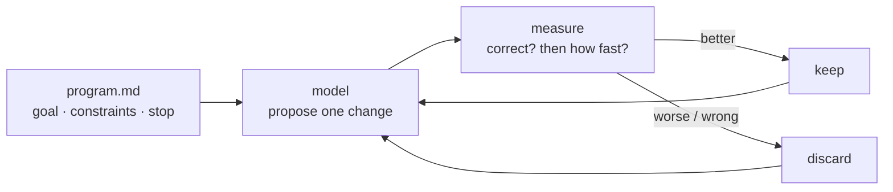

# Autoresearch

An agent edits one file, measures, keeps or discards — and repeats without you.

*You are the slow part of research, not the thinking.*

- Category: agent
- Verified against: [karpathy/autoresearch](https://github.com/karpathy/autoresearch) · scored by exact correctness + wall-clock
- Status: 🟡 in progress

## Summary



1. **Why** — the bottleneck is the human between experiments. Remove them and it runs ~12/hour.
2. **How** — `program.md` sets goal, constraints, stopping. The agent proposes one change to one file; a metric decides; keep or discard. Repeat.
3. **Without it** — you hand-run experiments at human speed.

## Reference

| path | agent reads | agent writes | Karpathy's |
|---|---|---|---|
| `src/` | **yes** | **yes** — on a win | `train.py` |
| `program.md` | **yes** — every prompt | no | `program.md` |
| `harness/` | no | no | `prepare.py` |
| `main.ipynb` | no | no | the runner |

`harness/` never enters a prompt, so it can't be argued with — an agent that can edit the
verifier deletes the failing case instead of passing it.

**One loop, deliberately.** His ~630 lines have no verifier abstraction, no state, no strategy
rewriting. The lever is `program.md`, not the loop.

## Verification

`return 0` is rejected — `WRONG on n=10: got 0, want 23`. Correctness gates timing, so a faster
wrong answer scores nothing. Min of 5 (baseline spreads `86.6–88.9 ms`):

| | ms |
|---|---|
| naive baseline | `87.57` |
| what the loop found | `0.0004` (~233,000×) |

## Run

```bash
cp ../.env.example ../.env   # DEEPINFRA_API_KEY
uv sync
# commit first — the first win overwrites src/solve.py
```

## Links

- [karpathy/autoresearch](https://github.com/karpathy/autoresearch)
