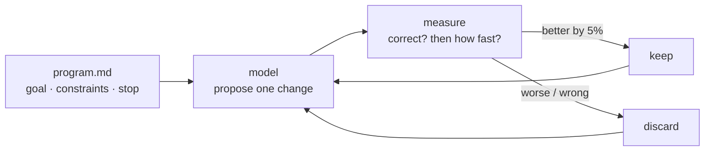

# Autoresearch

An agent edits one file, measures, keeps or discards — and repeats without you.

*You are the slow part of research, not the thinking.*

- Category: agent
- Verified against: [karpathy/autoresearch](https://github.com/karpathy/autoresearch) · scored by exact correctness + wall-clock
- Status: 🟡 in progress

## Summary



1. **Why** — the bottleneck is the human between experiments. Remove them and it runs unattended.
2. **How** — `program.md` sets goal, constraints, stopping. The agent proposes one change to one file; a metric decides; keep or discard. Repeat.
3. **Without it** — you hand-run experiments at human speed.

## Reference

| path | agent reads | agent writes | Karpathy's |
|---|---|---|---|
| `src/` | **yes** | **yes** — on a win | `train.py` |
| `program.md` | **yes** — every prompt | no | `program.md` |
| `harness/` | no | no | `prepare.py` |
| `main.ipynb` | no | no | the runner |

`harness/` never enters a prompt, so it can't be argued with — an agent that can edit the
verifier deletes the failing case instead of passing it.

**One loop, deliberately.** His ~630 lines have no verifier abstraction, no state, no strategy
rewriting. The lever is `program.md`, not the loop.

## The task

`solve(n)` counts the primes below `n`, starting from the sieve everyone writes first.
Deliberately **no closed form** — one insight can't end the search, so the loop has to climb.
The rungs above the baseline, each hand-written and scored by the same `measure`:

| rung | ms | vs prev |
|---|---|---|
| 0 the sieve in `src/` — baseline | `69.4` | — |
| 1 + slice assignment | `6.8` | 10.1× |
| 2 + odds only | `3.3` | 2.1× |

A closed-form task ends at experiment 1 and measures noise for the rest. This one has `20.9x`
on the table and no single step that reaches it.

Last run (15 experiments, Llama-4-Maverick): the loop found odds-only at experiment 8 and
stopped at `2.6x`. It never proposed slice assignment. See the notebook.

## Verification

`return 0` is rejected — `WRONG on n=7: got 0, want 3`. Correctness gates timing, so a faster
wrong answer scores nothing. `n=7` is in the cases because it is the only test a `<= n`
off-by-one fails: `10`, `100`, `1000` and `2000000` are all composite, so they can't see it.

`measure` takes the **min of 3** runs — the spread is then 1–3% — and a win must clear **5%**.
See the notebook for the run and Weaknesses.

## Run

```bash
cp ../.env.example ../.env   # DEEPINFRA_API_KEY
uv sync
# commit first — the first win overwrites src/solve.py
```

## Links

- [karpathy/autoresearch](https://github.com/karpathy/autoresearch)
