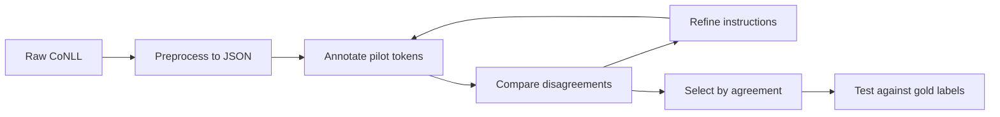

# DiZiNER: disagreement-guided NER

Independent annotators disagree; a supervisor refines their instructions without gold labels or weight updates.

*Annotators compare notes; the supervisor turns their disagreements into clearer instructions.*

- Category: agent
- Verified against: DiZiNER equations and four-phase pipeline · strict entity micro-F1
- Status: 🟡 in progress — Thai–English pilot completed; modest improvement on 40 test examples

## Summary



1. **Why** — NER annotators disagree on entity types and boundaries.
2. **How** — a supervisor refines their prompts; pilot agreement selects candidates for matched baseline/refined testing.
3. **Without it** — the initial prompt keeps repeating the same annotation mistakes.

## Reference

- [main.ipynb](main.ipynb): tokens → annotation → disagreement → refinement → evaluation.
- [preprocess.py](preprocess.py): local CoNLL → cleaned JSON; removes duplicate training examples and train/test overlaps.
- [pipeline.py](pipeline.py): prompt refinement, selection, and testing; [metrics.py](metrics.py): strict span scoring.
- [Method notes](docs/reference-check.md): reference comparison and adaptations.

| Path | Contents |
|---|---|
| [data/raw/](data/raw/README.md) | Original train, test, and dev CoNLL splits; dev is unused |
| [data/pilot/](data/README.md) | Processed splits, `schema.json`, and `metadata.json` |
| `runs/pilot/selection.json` | Candidates ranked by pilot agreement |
| `runs/pilot/selected_model.json` | Highest-ranked prompt configuration |
| `runs/pilot/baseline_model.json`, `improved_model.json` | Matched baseline and changed prompt |
| `runs/pilot/evaluation/*.json` | Input tokens, predicted spans, and per-prompt scores |
| `runs/pilot/summary.json` | Overall scores and baseline/refined F1 differences |
| `runs/pilot/usage.json` | API requests and costs |

“Improved” means refined; the file exists only if the prompt changed. Selection uses pilot agreement, not test accuracy. Model weights and the entity schema stay fixed.

## Verification

72 automated tests passed, covering CoNLL parsing, data cleaning, local-file training/testing, scoring, and resume checks. All exported raw records were checked against the pinned Hugging Face source for exact tokens, labels, language, and source metadata.

The recovered pilot completed testing on 40 English/Thai examples. Mean selected F1 rose from **17.12% to 18.78% (+1.66 percentage points)**; Mistral iteration 4 scored highest at **26.74%**. This small sample does not establish general improvement. See [selection and results](docs/reference-check.md#completed-pilot) and [recorded metrics](docs/pilot-results.json).

## Run

Set `OPENROUTER_API_KEY` and `OPENROUTER_MODEL` in the repository’s `.env`. Run from `agt_diziner/`:

```bash
uv sync
uv run pytest -q
uv run python preprocess.py --data data/raw --output data/pilot
uv run python pipeline.py --stage train --data data/pilot/train.json --output runs/pilot
uv run python pipeline.py --stage test --data data/pilot/test.json --output runs/pilot
uv run python -m json.tool runs/pilot/summary.json
```

The default `config.pilot.json` uses 200 training-pool examples, 5 rounds × 8 examples, and 40 test examples. Preprocessing is local; training and testing call OpenRouter. Training pairs `train.json` with its sibling `test.json` (`--test-data` overrides this). Testing evaluates every example in the supplied file and prints the saved prediction paths.

For another preset, pass the same `--config` to all three stages and choose matching data/run directories:

| Config | Data | Output |
|---|---|---|
| `config.pilot.en.json` | `data/pilot-en` | `runs/pilot-en` |
| `config.pilot.th.json` | `data/pilot-th` | `runs/pilot-th` |
| `config.full.json` | `data/full` | `runs/full` |
| `config.paper.json` | `data/paper` | `runs/paper` |

Full and paper presets need `uv sync --extra grouping`.

To resume, repeat the command with the same data, config, and output. Cached responses are reused. Budgets include prior sessions; `max_requests` and `max_cost_usd` may be increased. Changes to data, code, or other settings require a new directory, such as `runs/pilot-v2`.

## Predict on your text

Save records like the test data, keeping only `tokens`, in `data/tokens.json`:

```json
[
  {"tokens": ["John", "works", "at", "Google", "."]},
  {"tokens": ["John", "works", "at", "Facebook", "."]}
]
```

From `agt_diziner/`:

```bash
uv run python predict.py --prompt runs/pilot/selected_model.json \
  --tokens data/tokens.json --lang en --output runs/predict
```

Predictions are saved as token/BIO-label rows to `runs/predict/predictions.conll`; sentences are separated by blank lines, and the terminal prints the full path. Use `--lang th` for Thai input.

## Links

- [Paper](https://aclanthology.org/2026.acl-long.795/) · [Pinned reference code](https://github.com/SiunKim/diziner-ner/tree/2577f8ce7f06f0554e88b1931f9e0c9626c24f17)
- [Dataset](https://huggingface.co/datasets/weerayut/thai-english-financial-ner) · [Raw source manifest](data/raw/metadata.json)
