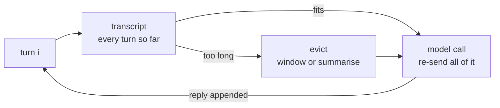

# Multi-step + memory

The API is stateless; memory is whatever you choose to re-send.

*The model wakes with amnesia every call. A "conversation" is a trick you perform by re-reading
the whole transcript aloud each turn — and eviction is deciding what to stop reading.*

- Category: agent
- Verified against: LangGraph reference loop (checkpointer + thread state) · scored by fact recall + prompt tokens, not allclose
- Status: 🟡 in progress

## Summary



1. **Why** — every call is a fresh universe. Tell the model a fact, ask about it in the next call, and it's gone. "Remembering" is you replaying the transcript.
2. **How** — append each turn and re-send. Once that outgrows the context window (or the budget), evict: drop old turns, or compress them into a summary and keep the recent ones verbatim.
3. **Without it** — a stateless bot, or an unbounded transcript that eventually costs more than it's worth.

## Reference

- `main.ipynb`: amnesia → replay the transcript → the two evictions, measured.
- Measured on a 6-turn chat, asking a fact stated in turn 1:

| strategy | prompt tokens | recalls the fact? |
|---|---|---|
| full history | 189 | yes |
| `summarise` (keep 2) | 85 | yes |
| `window(2)` | 42 | **no** |

Evicting that transcript, asked `"What is my favourite tokenizer?"` — the fact is in turn 1,
so what you keep decides whether it survives:

```text
full history ────────────────────────────────── 189 tok
  1 user  "My favourite tokenizer is BPE."          ← the fact
  2 asst  "Byte Pair Encoding (BPE) is a popular…"
  3 user  "I am working through a curriculum of 18 LLM mechanisms."
  4 asst  "That sounds like a solid plan."
  5 user  "Today I built tool calling."
  6 asst  "Great — tool calling is the basis for agents."
  → "You mentioned earlier that your favourite tokenizer is Byte Pair Encoding…"

window(2) ─────────────────────────────────────  42 tok
  5 user  "Today I built tool calling."
  6 asst  "Great — tool calling is the basis for agents."
  → turns 1–4 dropped. "I don't have any prior knowledge about…"

summarise(keep=2) ─────────────────────────────  85 tok
  S sys   "Conversation so far: You are working through a curriculum that covers
           18 LLM mechanisms, and you mentioned that your favourite tokenizer
           is Byte Pair Encoding (BPE)."
  5 user  "Today I built tool calling."
  6 asst  "Great — tool calling is the basis for agents."
  → turns 1–4 compressed. "Your favourite tokenizer is Byte Pair Encoding (BPE)."
```

## Verification

Fact recall against a known fact planted in turn 1, plus `usage.prompt_tokens` per strategy (table above). Stateless baseline confirms the model has no side channel.

## Run

```bash
cp ../.env.example ../.env   # repo-root .env: add DEEPINFRA_API_KEY (shared, gitignored)
uv sync                      # per-module venv from this pyproject.toml
# run main.ipynb
```

## Links

- [LangGraph persistence](https://langchain-ai.github.io/langgraph/concepts/persistence/) — checkpointers, thread state
