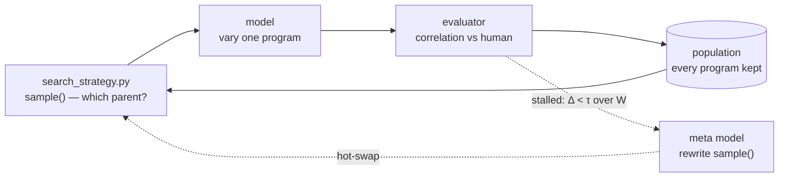

# Meta-evolution

A second loop watches the first and rewrites its search when it stalls.

*The search strategy is code, so it can be evolved like any other code.*

- Category: agent
- Verified against: [EvoX](https://arxiv.org/abs/2602.23413) ([skydiscover](https://github.com/skydiscover-ai/skydiscover)) · scored by correlation with human judgement
- Status: 🟡 in progress

## Summary



1. **Why** — a fixed search strategy has fixed blind spots. Greedy selection re-asks the same question; the loop cannot notice that its *method* is what's stuck.
2. **How** — every program is kept. `sample()` picks the parent, so `sample()` *is* the strategy. Watch a window of `W`; if `Δ < τ`, a second model rewrites that method and it is hot-swapped in.
3. **Without it** — you hand-tune explore/exploit knobs per task, and re-tune them as the search space changes underneath you.

## Reference

| path | inner loop | outer loop | EvoX's |
|---|---|---|---|
| `initial_program.py` | **rewrites** | no | `initial_program.py` |
| `search_strategy.py` | no | **rewrites** | `EvolvedProgramDatabase` |
| `evaluator/` | no | no | `evaluator/` |
| `main.ipynb` | no | no | `coevolve_controller.py` |

Two editable files is the whole idea: one loop evolves the answer, the other evolves the search.
Neither sees `evaluator/` — a searcher that reads the scorer fits it.

**Demand-driven, not periodic.** The strategy is rewritten only when `Δ < τ`. A search that is
still climbing is left alone. Scope is deliberately half of EvoX: it evolves *selection*, not the
variation operator.

## Verification

Scoring is deterministic — a correlation against held-out judgement, nothing timed — so the same
program always scores the same. A constant is rejected (`constant 1.0 for every pair`); so is
anything outside `[0, 1]`, which caught a real candidate returning `-0.5`.

The task has a ladder, and its first rung is a trap:

| | corr |
|---|---|
| char Levenshtein — the seed | `0.335` |
| token Jaccard | `0.129` |
| char + negation guard | `0.724` |

The seed rates *"the door is open"* / *"the door is **not** open"* at `0.80` where a human says
`0.10`. Switching to tokens alone makes it **worse**, so a greedy climber tries it, retreats, and
never reaches the rung that pays.

Last run: seed `0.335` → best `0.479` over 15 programs and 2 strategies. Gen 1 spent all five
proposals on the same parent and stalled; the rewrite diversified them. See the notebook — one
trace shows the mechanism, not the gain.

## Run

```bash
cp ../.env.example ../.env   # DEEPINFRA_API_KEY
uv sync                      # from inside this dir
# commit first — both loops overwrite their file in place
```

## Links

- [EvoX: Meta-Evolution for Automated Discovery](https://arxiv.org/abs/2602.23413)
- [skydiscover-ai/skydiscover](https://github.com/skydiscover-ai/skydiscover)
