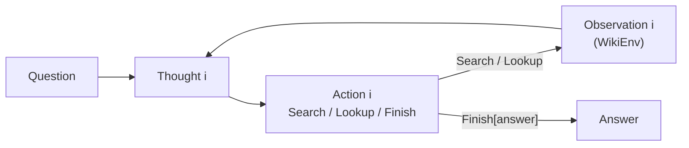
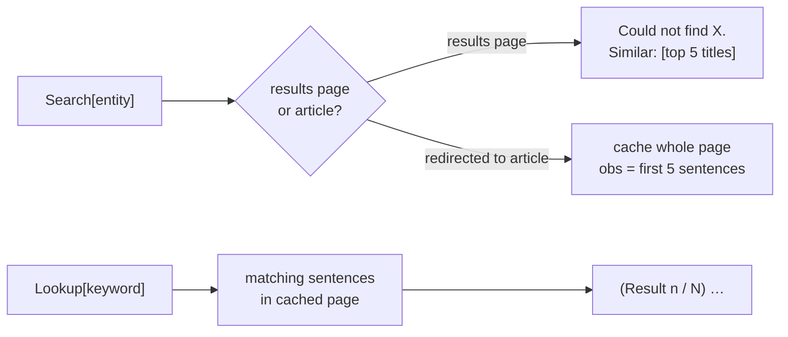

# ReAct loop

Interleave Thought → Action → Observation until `Finish[answer]`.

*How you'd actually answer a trivia question: think, look it up, let what you find change the
next thought. Thinking alone invents facts; searching alone flails.*

- Category: agent
- Verified against: [`ysymyth/ReAct`](https://github.com/ysymyth/ReAct) (`WikiEnv` ported) · scored by EM/F1, not allclose
- Status: 🟡 in progress

## Summary



1. **Why** — one-shot answers hallucinate facts they don't have; ReAct *acts* (search/lookup) between reasoning steps to ground the answer in retrieved evidence.
2. **How** — a Thought → Action → Observation loop; Actions are `Search[entity]` / `Lookup[keyword]` / `Finish[answer]` over Wikipedia. Reasoning picks the next action; observations correct the reasoning.
3. **Without it** — CoT hallucinates, act-only flails; interleaving fixes both.

## `WikiEnv` — the environment

Text-only Wikipedia, two affordances: search a page, Ctrl+F inside it.
`step(action: str) -> tuple[str, bool]` — always `(obs, done)`; only the branch and `done` vary.



1. **`Search` rides a redirect** — hits `index.php?search=…`, so an exact match lands on the article and anything else returns a results page; `div.mw-search-result-heading` tells the two apart.
2. **`Lookup` is Ctrl+F with paging** — sentences in the *cached* page matching the keyword, one at a time. Needs a prior `Search`.
3. **The 5-sentence truncation is the point** — return the whole article and the agent answers in one shot. Withholding forces it to reason about what to look up next; that's what creates the interleaving.

Four detours for one fact — each step exists only because the last one withheld something:

| Action | Branch → `done` | `obs` |
|--------|-----------------|-------|
| `Search[Colorado orogeny]` | `page obs`, 5 sentences → `False` | no mention of "eastern sector" |
| `Lookup[eastern sector]` | `(Result n / N)` paged hit → `False` | …extends into the High Plains |
| `Search[High Plains]` | `page obs` → `False` | disambiguation prose — useless |
| `Search[High Plains (United States)]` | `page obs` → `False` | the elevation sentence |
| `Finish[1,500 to 6,000 ft]` | terminal → `True` | `Episode finished, answer = …` |

`Search` has a fourth branch this trace never hit: no article at all returns `Could not find X. Similar: [top 5 titles]`.

## Reference

- `final.ipynb`: `WikiEnv`, few-shot prompt, Llama policy (DeepInfra, OpenAI-compatible API), loop, HotpotQA demo eval.
- Loop turn: assistant = `Thought i` + `Action i` (stop before Observation); user = real `Observation i`.

## Weaknesses

- **`stop=["\nObservation"]` is load-bearing** — without it the model invents observations and never calls the tool.
- **Chat turns, not prefill** — model each Thought+Action as an assistant turn, each Observation as a user turn.
- **Wikipedia needs a `User-Agent`** — the default one 403s, observations arrive empty, and the agent quietly answers from the few-shot examples instead. A broken env scored *better* than a fixed one.
- **Live Wikipedia drifts from gold** — the High Plains article now says 1,500–6,000 ft vs HotpotQA's 1,800–7,000 ft, so a grounded run disagrees with the gold. EM under-reports. [gap journal](../docs/gap-journal.md).

## Verification

`WikiEnv` parsing + EM/F1 metrics unit-checked; end-to-end scored by exact-match / token-F1 on a small HotpotQA slice (demo cell).

## Run

```bash
cp ../.env.example ../.env   # repo-root .env: add DEEPINFRA_API_KEY (shared, gitignored)
uv sync                      # per-module venv
# run final.ipynb (needs network for Wikipedia)
```

## Links

- [ReAct paper](https://arxiv.org/abs/2210.03629) (Yao et al., 2022) · [reference code](https://github.com/ysymyth/ReAct)
