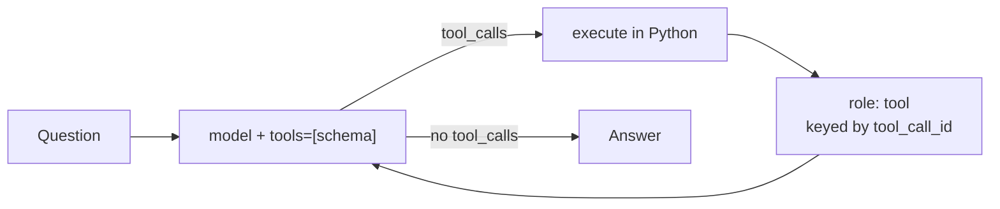

# Tool calling

Give the model a typed escape hatch to real code: it asks, you execute.

*A brain in a jar — fluent, and unable to multiply or read a clock. The schema is a menu it
can point at; you are the hands.*

- Category: agent
- Verified against: OpenAI tool-call wire format (via DeepInfra) · scored by exact arithmetic, not allclose
- Status: 🟡 in progress

## Summary



1. **Why** — LLMs predict tokens, they don't compute. Asked for `47281 * 918` the model returned `43295058`, then `43301338` on a re-run; the truth is `43403958`. Fluent, confident, wrong — and wrong differently each time.
2. **How** — pass tools as JSON Schema; the model replies with structured `tool_calls` (name + `arguments`) instead of prose; you run the real function and feed the result back as a `tool` turn. Loop until it stops asking.
3. **Without it** — either fluent wrong answers, or a hand-maintained regex over free text.

## Reference

- `main.ipynb`: the wrong answer, tool + schema, one call, the loop.
- A tool is **two things that must agree** — the Python implementation (the model never sees it) and the schema (the only thing it can reason about). `description` and parameter names are prompt text.

## Verification

Exact arithmetic, not `allclose`: the model alone gets `47281 * 918` wrong; with the tool it returns `43403958` exactly. `tool_calls` is checked against the schema (name resolves in `IMPLS`, `arguments` parse to the declared types).

## Run

```bash
cp ../.env.example ../.env   # repo-root .env: add DEEPINFRA_API_KEY (shared, gitignored)
uv sync                      # per-module venv from this pyproject.toml
# run main.ipynb
```

## Links

- [OpenAI function calling](https://platform.openai.com/docs/guides/function-calling) (the wire format DeepInfra implements) · [DeepInfra docs](https://deepinfra.com/docs)
