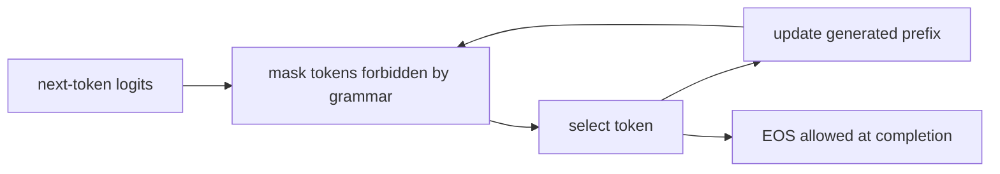

# Structured output

Constrained decoding restricts what the model can emit; it does not guarantee the content is correct.

*Sampling chooses a next token from a menu; a grammar removes choices that cannot lead to an allowed output.*

- Category: inference
- Verified against: saved live responses from llama.cpp b10883
- Status: 🟡 in progress

## Summary

**Objective:** Compare the same request without and with schema enforcement.

**Input:** A movie review, e.g. `"I loved this film."`

**Expected output:** `{"label": "positive"}`

**Evaluation:** Check JSON validity, schema compliance, and sentiment accuracy.



1. **Why** — programs need predictable output fields and types.
2. **How** — mask illegal tokens before selection, updating the grammar state after each token.
3. **Without it** — asking for JSON leaves format compliance to the model.

## Reference

- `main.ipynb`: setup → without schema enforcement → with schema enforcement.
- Both requests use the same review and generation settings; only `response_format` changes.
- Each cell shows the payload in code and prints only the model response.

## Verification

Live comparison executed with llama.cpp build 10883 (`91f6a6cf3`), CPU, and
`LFM2.5-1.2B-Instruct-Q4_K_M.gguf` from model revision
`6767265158422fb8a19c62ceb45f16f05363615b`.

For the review used in the demo:

| Schema enforcement | Observed output |
|---|---|
| Off | JSON followed by extra prose; invalid as a whole |
| On | `{"label": "positive"}` |

Both responses finished normally. The notebook shows the input in code and prints only the output
in two direct request cells. Saved responses come from the earlier live run;
this edit does not rerun inference. This example demonstrates format enforcement,
not a guarantee of correct sentiment.

## Run

```bash
cd inf_structured_output
# Deactivate any other active venv first.
uv sync
```

Open `main.ipynb` and select this module's `.venv` kernel. Start the server below
before Run All. Both demo cells make live requests.
No API key is needed.

For live inference, install llama.cpp using the linked installation instructions, then run
this command in another terminal (first run downloads the model from Hugging Face):

```bash
llama-server -hf LiquidAI/LFM2.5-1.2B-Instruct-GGUF:Q4_K_M \
  --alias local-lfm -c 4096 --host 127.0.0.1 --port 8080
```

On the current Linux workspace, the runtime and model are installed under the gitignored
`.runtime/` directory. Restart them with `bash start_server.sh` from this module.
That script uses the local installation; on another machine, use the installation and
`llama-server` command above.

Wait for the server to finish loading, then Run All. Run the live cells in order;
each changes only `response_format` on the same payload.
`LLAMA_BASE_URL` optionally overrides `http://127.0.0.1:8080/v1`.
HTTP/connection failures raise directly.
Record `llama-server --version` and the model quantization when comparing runs.

## Links

- [Liquid llama.cpp deployment and installation](https://docs.liquid.ai/deployment/on-device/llama-cpp)
- [Original structured-output reference](https://docs.liquid.ai/deployment/on-device/llama-cpp/structured-output) (unavailable when checked)
- [llama.cpp grammars and JSON Schema support](https://github.com/ggml-org/llama.cpp/blob/master/grammars/README.md)
- [llama.cpp server response formats](https://github.com/ggml-org/llama.cpp/blob/master/tools/server/README.md)
