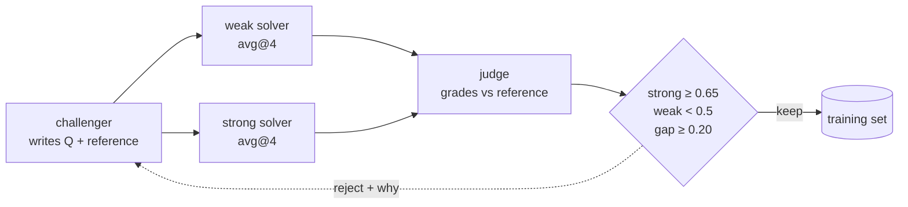

# Agentic Self-Instruct

Generated examples are worthless unless they separate a strong model from a weak one.

*A test everyone passes and a test nobody passes are the same test: neither tells you who knows
the material. The gap between two solvers IS the signal.*

- Category: post-training
- Verified against: [Autodata](https://arxiv.org/abs/2606.25996) — baseline strong−weak gap
  `0.02 → 0.314` on CS research tasks
- Status: 🟡 in progress

## Summary



1. **Why** — a challenger asked for training data writes what is easy to write: table lookups.
   The model you are training already knows those. Volume is not the constraint; *difficulty*
   is, and difficulty is only measurable against a solver.
2. **How** — score every candidate with two solvers of different strength, `avg@4` each. Keep
   only what the strong model gets right and the weak model gets wrong. The gap is the filter.
3. **Without it** — you generate 10k examples, train on them, and move nothing: the model was
   already right on most of them.

## Steps

| # | step | who |
|---|------|-----|
| 1 | **Write** a question + a reference answer from the source | challenger |
| 2 | **Attempt** it, `K=4` rollouts at temperature | weak solver, strong solver |
| 3 | **Grade** every rollout against the reference → `avg@4` per solver | judge |
| 4 | **Filter**: `strong ≥ 0.65`, `weak < 0.5`, `gap ≥ 0.20` | controller |
| 5 | **Tell** the challenger why each one died, and ask again | orchestrator |

Step 4 is the mechanism. `strong ≥ 0.65` does double duty: it drops what is too hard, *and* it
drops examples whose reference answer is wrong — the strong model cannot match a broken
reference either, so bad references fail the same test as bad questions.

## Reference

| path | role | Autodata's |
|---|---|---|
| `source.md` | grounded material — fictional, so no solver can recall it | domain corpus |
| `main.ipynb` | four subagents + the acceptance rule | Agentic Self-Instruct |

Three models, four roles: the challenger and the strong solver are the same model, and the
judge is a different family from both — it should not grade its own homework.

**Scope is deliberately the inner loop.** The paper wraps this in a meta-optimizer that evolves
the challenger's own prompt (Boltzmann sampling at `T=0.1`, a code-editing agent mutating it,
accepting only when validation strictly improves — `62.1% → 79.6%` over 126 accepted of 233
iterations). Not implemented here.

## Verification

Weak = Llama-3.1-70B, strong = Qwen3-235B, judge = Qwen2.5-72B, `avg@4`. One run of `main.ipynb`:

| arm | mean weak | mean strong | mean gap | kept |
|---|---|---|---|---|
| vanilla self-instruct | 0.850 | 0.875 | **+0.025** | 1/10 |
| agentic, round 1 | 0.625 | 0.975 | **+0.350** | 2/10 |
| agentic, round 2 (fed the rejects) | 0.550 | 0.775 | **+0.225** | 2/10 |

The gap opens `+0.025 → +0.350` — the paper's baseline is `0.02 → 0.314` on a different task.
Across three separate runs vanilla held at `+0.033 / +0.050 / +0.025`, so the baseline is stable.

**Two things the run showed that the method does not promise:**

- **The challenger collapses to one template.** All 10 round-1 questions were *"A ⟨N⟩ kg
  ⟨surcharge⟩ consignment ... with the Anchor account"* — it found one gap-opening shape and
  repeated it. Diversity is not part of the objective, so nothing pushes back on this.
- **Feeding the rejects back did not help.** Round 2's gap fell to `+0.225`. In earlier runs
  the same step went up, down, and flat — unguarded, it is a random walk. This is exactly the
  step the paper guards by accepting a mutation only when validation strictly improves.

The three negative-gap rows are solver noise, not bad references: each reference checks out by
hand (`450 kg fragile Zone B = 8550 × 1.15 = 9832.5`), and the strong model simply slipped on
`avg@4`. `avg@4` is coarse — `avg@8` would tighten it.

## Run

```bash
cp ../.env.example ../.env   # DEEPINFRA_API_KEY
uv sync                      # from inside this dir
# run main.ipynb — ~10 min, ~500 API calls across three model tiers
```

## Links

- [Autodata: An agentic data scientist to create high quality synthetic data](https://arxiv.org/abs/2606.25996)
- [Self-Instruct](https://arxiv.org/abs/2212.10560) — the baseline this improves on
