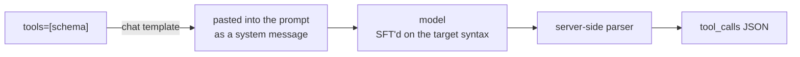

# Tool-calling SFT

`tools=` is not an API feature. It's a prompt, a fine-tuned habit, and a parser.

*Nobody taught the model to "call functions". They taught it that after a `<tools>` block, the
next thing you write is `<tool_call>{…}</tool_call>` — and wrote a parser to catch it.*

- Category: post-training
- Verified against: `Qwen2.5` chat template (rendered, not assumed) · scored by inspecting the rendered target + mask, not allclose
- Status: 🟡 in progress

## Summary



1. **Why** — to see that "tool calling" is three ordinary layers, none of them enforced: text in the prompt, a habit in the weights, a regex on the server.
2. **How** — the template pastes your schema into a system message; SFT teaches the model that a `<tools>` block is followed by `<tool_call>{…}</tool_call>`; the provider parses that back out. Training data = that prompt + the call you want, with loss on the call only.
3. **Without it** — you treat `tools=` as a contract and are surprised when the model ignores it, invents arguments, or leaks raw template text into `content`.

## Reference

Rendered — not paraphrased. `apply_chat_template(USER, tools=TOOLS)` on `Qwen2.5`:

```text
<|im_start|>system
# Tools
You may call one or more functions to assist with the user query.
You are provided with function signatures within <tools></tools> XML tags:
<tools>
{"type": "function", "function": {"name": "multiply", "description": "Multiply two …"}}
</tools>
For each function call, return a json object with function name and arguments within
<tool_call></tool_call> XML tags:<|im_end|>
<|im_start|>user
What is 47281 * 918?<|im_end|>
<|im_start|>assistant
```

Your schemas, verbatim, as text. `43 -> 384` tokens for the three tools — `185` for one,
`262` for two. Every call pays for every tool.

| part of the row | tokens | loss? |
|---|---|---|
| prompt (template + schemas + query) | 384 | masked `-100` |
| target `<tool_call>{…}</tool_call>` + end token | 32 | scored |

That target string is the whole thing being learned:

```text
<tool_call>
{"name": "multiply", "arguments": {"a": 47281, "b": 918}}
</tool_call><|im_end|>
```

## Verification

The rendered template is read, not assumed — every claim above is printed by `main.ipynb`. Token counts come from the tokenizer (`43 -> 384` for three tools, 32 scored). The mask is checked by construction: `len(labels) == len(input_ids)`, with `-100` covering exactly the prompt.

## Run

```bash
uv sync        # tokenizer only — no torch, no GPU, no API key
# run main.ipynb
```

## Links

- [Qwen2.5 function calling](https://qwen.readthedocs.io/en/latest/framework/function_call.html) · [HF chat templates for tools](https://huggingface.co/docs/transformers/main/en/chat_templating#advanced-tool-use--function-calling)
