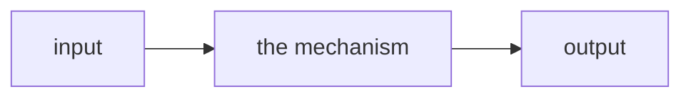

# <mechanism name>

One-line takeaway — the sentence that goes in the index row.

- Category: <tokenization · architecture · training · post-training · inference · agent>
- Verified against: <reference.impl> · allclose @ rtol=1e-4: <✅ / —>
- Status: 🔲 planned · 🟡 in progress · ✅ done

## Summary

One glance — a diagram, formula, or image that captures the mechanism (mermaid
data flow, the core equation, or a `` image; pick whatever rereads
fastest):

The three things I can now explain from memory:

1. Why it exists — <the problem it solves>
2. How it works — <the mechanism and the one insight that makes it click>
3. What breaks without it — <the failure modes it prevents>

## Reference

The parts I'll look up again — core formula, tensor shapes, key API:

<equations · shapes · signature>

## Weaknesses

What I got wrong at first, and the fix. Deeper entries: [gap journal](../../docs/gap-journal.md).

## Verification

How I confirmed it matches the reference (allclose @ rtol=1e-4), and the inputs covered.

## Links

Papers, lectures, and source read.