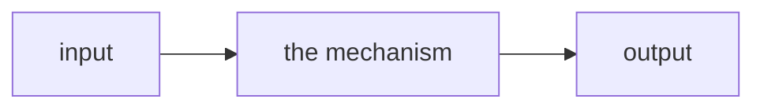

# <mechanism name>

<one-line takeaway — the sentence that goes in the index row>

*<intuition — the mental model, not the mechanics. What is this actually like?>*

- Category: <tokenization · foundations · training · architecture · inference · post-training · agent>
- Verified against: <reference.impl> · scored by <allclose @ rtol=1e-4 · EM/F1 · exact value · token counts>
- Status: 🔲 planned · 🟡 in progress · ✅ done

## Summary



1. **Why** — <the problem it solves>
2. **How** — <the mechanism, and the one insight that makes it click>
3. **Without it** — <the failure mode it prevents>

## Reference

- `main.ipynb`: <the arc, in the order the cells build it>
- <the parts you'll look up again — formula, shapes, key API>

## Weaknesses

What actually bit you, with the evidence — not theoretical caveats. Every row must have
survived a re-run; a wrong gotcha sends you chasing a bug that doesn't exist. If a weakness
has no fix, say so — "none, expect X" is a real answer.

| Weakness | What happens | Fix |
|---|---|---|
| **<the short name>** | <what you observed — the wrong output, the number, the error> | <what to do instead, or "none — <what to expect>"> |

## Verification

<How you confirmed it matches the reference, and on what inputs. Numbers here are
measured, never estimated.>

## Run

```bash
cp ../.env.example ../.env   # repo-root .env: add DEEPINFRA_API_KEY (shared, gitignored)
uv sync                      # per-module venv from this pyproject.toml
# run main.ipynb
```

## Links

<papers · reference code · docs read>
